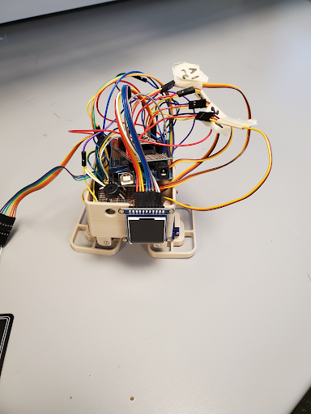
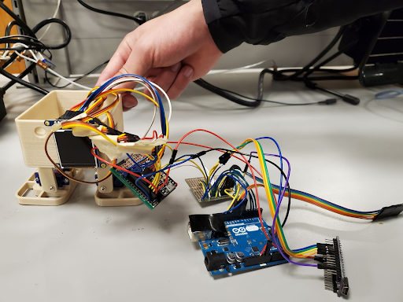
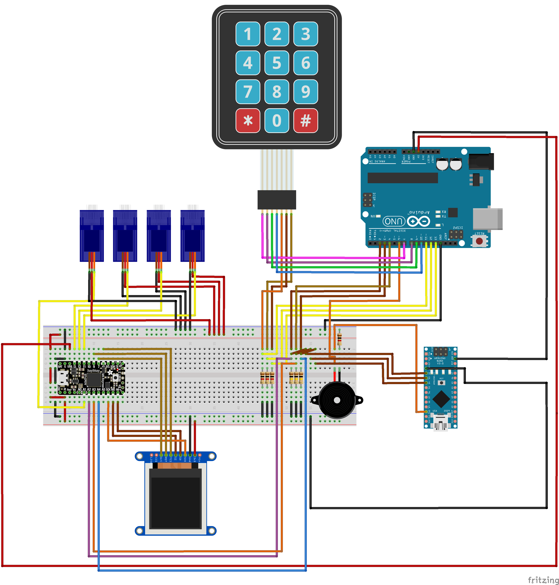

# Dancing Robot 

### CPEN291 Project - 2021W Term 2

> Group Members: Julian Wong, Tayyib Chohan, Justin Ng, Sam Dai 

---

### Project Overview
A mediocre dancing robot that can choose between 6 dances and songs to play using a keypad.  

We ran into a few issues with not having enough memory, so the robot uses 3 different microcontroller boards to communicate with each other using a simple serial communication protocol that we made to allow the boards to run concurrently. The ItsyBitsy acts us the master board that runs the main process for the dance movements and TFT display, while the UNO receives keypad input while playing songs. In this case, the Nano pretty much acted as a storage device for the song arrays and any extra files that were need ~~since we didn't have an SD card module~~. 

There's definitely a better way to handle the memory constraints, but part of the project requirements was to have the ItsyBitsy as the master control board >:(

---

### Component List

| Part                          | Description                                              | Quantity |
| ----------------------------- | -------------------------------------------------------- | -------- | 
| Adafruit ItsyBitsy M4 Express | Master Control Device                                    | 1        | 
| Arduino UNO R3 SMD Edition    | Slave Control Device 1                                   | 1        | 
| Arduino Nano                  | Slave Control Device 2                                   | 1        | 
| Piezzo Buzzer                 | Song Audio Output                                        | 1        |
| 3x4 Keypad 7-pin              | Song and dance selection                                 | 1        |
| Adafruit 1.44" Color TFT      | LCD Display for current song                             | 1        | 
| SG92R Servo Motors            | Control basic robot movement                             | 4        | 
| Breadboard                    | Solderless connections for the HC-SR04                   | 1        |
| Proto Board                   | Soldered connections for the TFT display and push button | 1        |  
| 100kOhm Resistor              | Pull down resistor circuit                               | 3        |
| 1kOhm Resistor                | Pull down resistor circuit                               | 4        |

---

### Robot Pictures 

---

### Fritzing Diagram 
